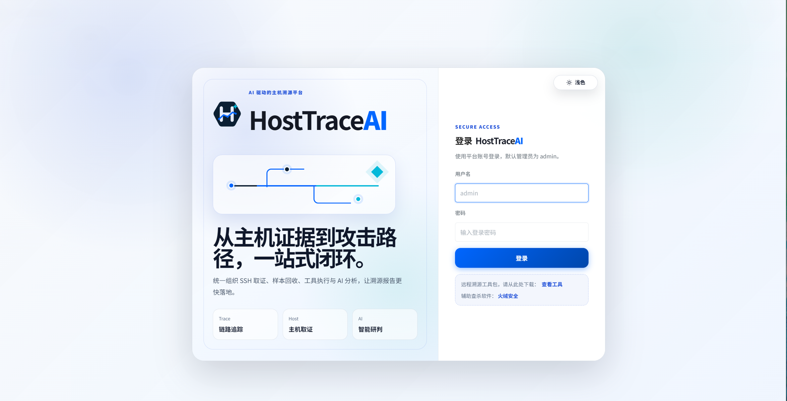
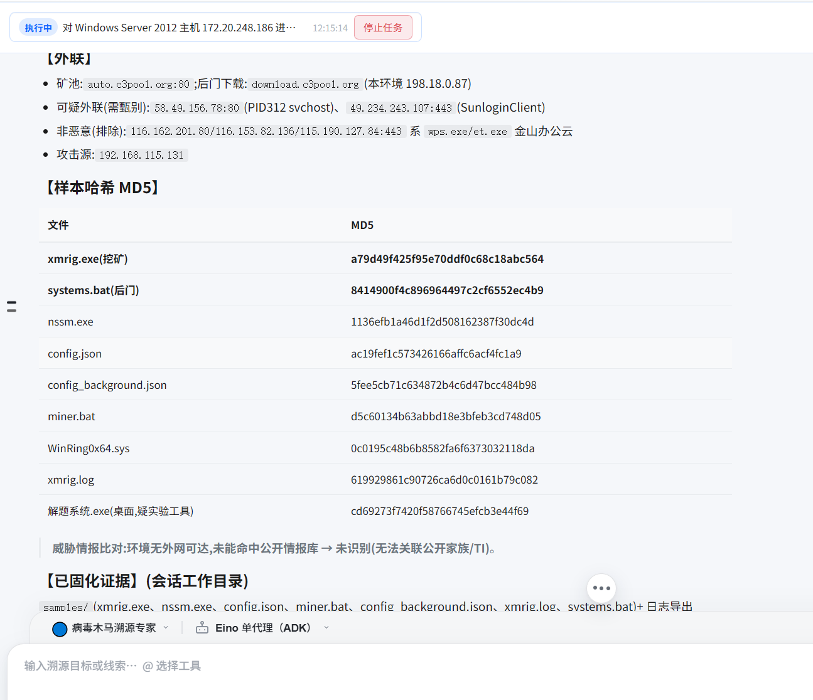
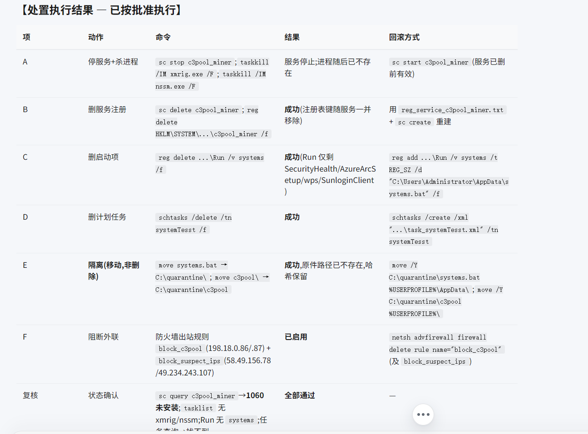

# HostTraceAI

HostTraceAI 是面向授权运维与安全响应的 AI 主机溯源平台。

它复用成熟的对话式 Agent、MCP 能力中心、Skill 加载、权限管理、系统设置、审计和 SQLite 持久化框架，但业务模型只围绕主机溯源展开：

- 通过 SSH/MCP 连接 Linux 或 Windows 主机；
- 由 AI 在调查过程中根据证据动态选择下一步动作；
- 记录进程、服务、启动项、计划任务、网络连接、文件和登录活动；
- 管理木马、WebShell、后门、挖矿和可疑持久化发现；
- 按主机保存样本、证据包、哈希和调查时间线；
- 对高风险操作提供审批、回滚提示和完整审计。

## 产品边界

HostTraceAI 不承担告警中心、漏洞扫描、资产测绘、渗透测试或 C2 平台职责。主机列表只用于溯源目标管理，发现项只表示主机调查证据，不等同于漏洞。

## 界面截图

**登录**



**病毒木马溯源 — 发现项、外联与样本哈希**



**审批处置 — 每个动作都记录回滚方式**



## 技术基础

- Go + Eino Agent 编排
- MCP 工具与能力中心
- Hermes 风格 Markdown Skill
- SQLite 主数据库与独立知识库
- WebSocket 对话和任务进度
- RBAC、审批和审计

配套的可选浏览器扩展（Chromium DevTools，用于把浏览器侧 Network 流量纳入调查）位于 `plugins/browser-extension/`，详见 `plugins/README.md`。

## 启动

```bash
cp config.example.yaml config.yaml
go run ./cmd/server --config config.yaml --http --port 19088
```

默认数据目录为 `data/`。证据文件存储在文件系统，数据库仅保存元数据、哈希和关联关系。

端口优先级为：命令行 `--port` > 环境变量 `HOSTTRACE_PORT` > `config.yaml`。首次启动会自动创建 `admin` 账号并生成一次性随机强口令；端口不会写入敏感凭据。

```bash
./run.sh --http --port 19088
HOSTTRACE_PORT=19088 ./hosttrace-ai --http
```

### 首次使用：配置 AI 模型（必做）

`config.example.yaml` 里的 AI 通道是**占位值**（`base_url: https://api.example.com/v1`，`api_key` 与 `model` 为空）。平台可以启动，但在填好之前**对话不可用**。

启动后按以下步骤操作：

1. 用启动日志里打印的一次性口令登录 `admin`（密码只显示一次，请立即保存并在设置中修改）；
2. 进入 **设置 → 基础设置 → AI 通道**；
3. 填写三项：**Base URL**、**API Key**、**模型名**；
   - 兼容 OpenAI 协议的服务（OpenAI、DeepSeek、通义千问、智谱、本地 vLLM/Ollama 等）均可直接使用；
   - 若服务商支持，可点「获取模型列表」自动拉取并下拉选择；Claude 需手动填写模型名；
4. 点「测试连接」确认可用后保存。

> 也可以直接编辑 `config.yaml` 的 `ai.channels.default` 段，再重启服务。

### 可选：启用知识库检索

知识库与视觉分析需要额外的 embedding / rerank 通道，同样在设置页配置。不配置不影响基础对话与溯源调查。

### 关于 Python 与 MCP

**Python 不是必需项。** 平台本体（Go 服务、Web 控制台、内置取证工具）在没有 Python 的环境下可以完整运行。`requirements.txt` 里的 Python 包只服务于 `mcp-servers/` 下的可选辅助脚本；`run.sh` 检测不到 python3 时会自动跳过，不影响启动。

示例配置里 `mcp.enabled: false`，这是刻意的默认值——**内置工具不依赖 HTTP MCP 服务**，平台开箱即用不缺少能力。需要用 SSH 连接远程主机或接入外部 MCP 时再打开，并在设置页配置对应服务。

内置取证工具位于 `tools/`（binwalk、exiftool、foremost、strings、exec），需要相应命令行程序已安装在目标主机上。

## 溯源专家

第一期内置两个专家：病毒木马溯源专家、WebShell 后门溯源专家。后续专家通过 Skill 和 MCP 工具注册，不需要改动平台核心。

## 安全原则

采集类动作默认只读；终止进程、禁用服务、隔离主机、阻断 C2 等动作需要策略允许或人工审批；删除文件、密码尝试、横向连接、网段扫描和未知脚本默认禁止。

本项目仅用于获得明确授权的主机调查与事件响应。
